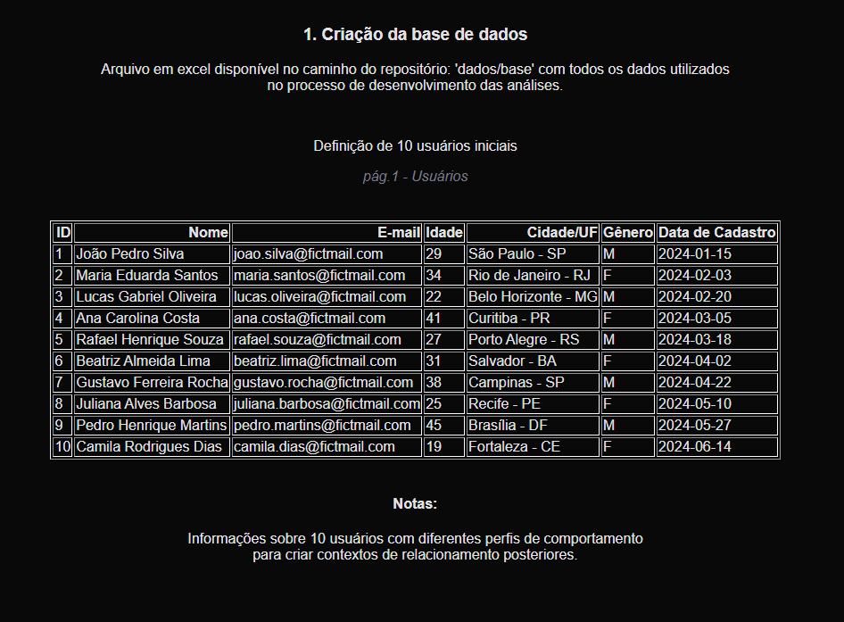
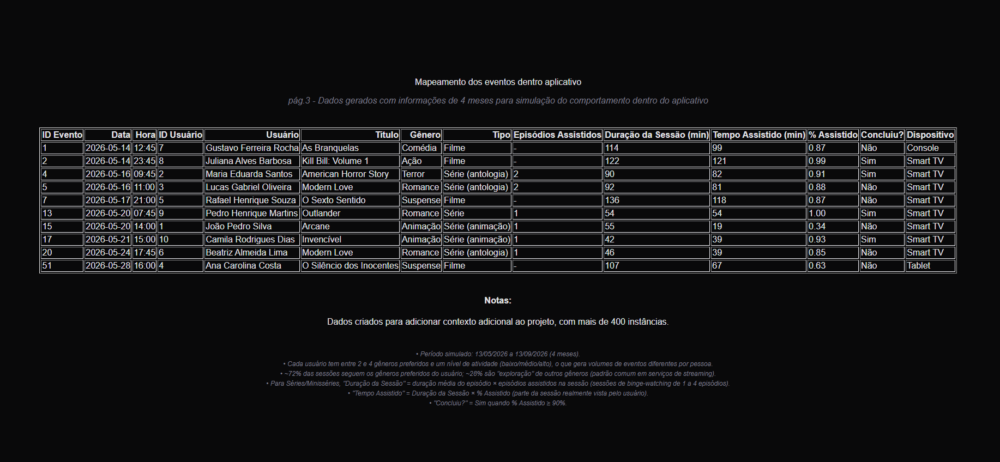

# DIO-project-SSR v1.0
Sistema de Busca por Recomendação (SSR)

## Visão geral
Este projeto será desenvolvido como uma solução inicial para busca e recomendação de conteúdos, com foco em organizar e recuperar informações relevantes de usuários de forma eficiente.

## Objetivo
Inicialmente é documentar todo o processo de desenvolvimento do projeto. Sua finalização será pelo Neo4j com visualização dos grafos correlacionados de acordo com os conteúdos e os usuários, com base em critérios de busca e afinidade, utilizando uma estrutura simples e escalável para evolução futura.

## Status atual
Até o momento, o repositório foi inicializado com a estrutura base do projeto e a definição do nome e objetivo principal.
A base de dados foi criada apenas com informações iniciais. 

## Conteúdo
Base de dados utilizada no projeto:

