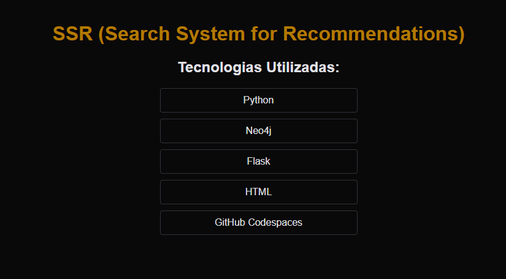
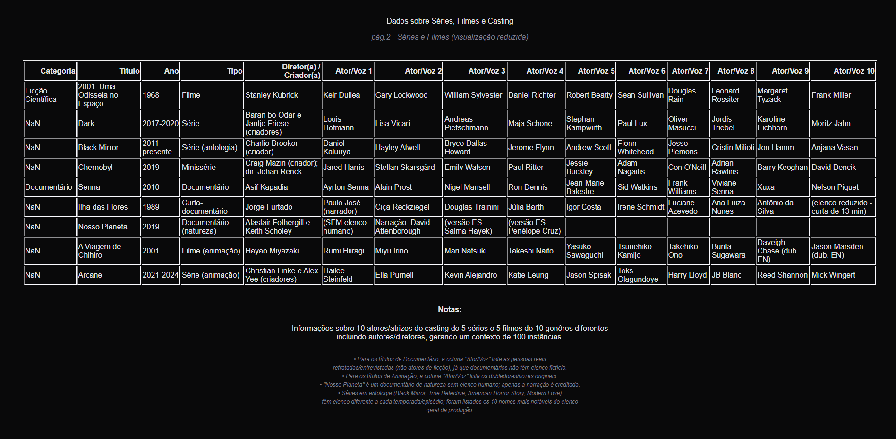
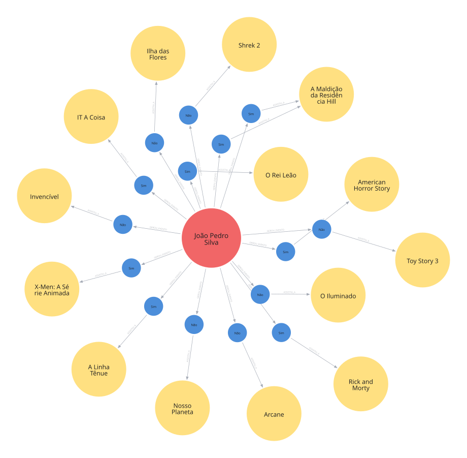
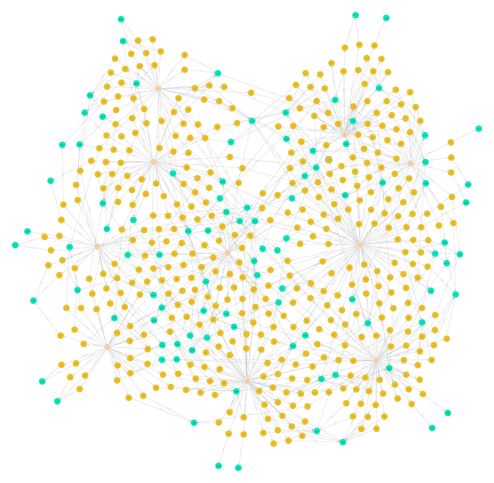

# DIO-project-SSR v1.0
### Sistema de Busca por Recomendação (SSR)
https://stunning-capybara-6vrwvw5pj6qph4r4p-8080.app.github.dev/

_Figura 1 - Tecnologias: todas as ferramentas utilizadas na construção do projeto_

## Visão geral
Este projeto consiste na criação de uma solução de análise de dados com a proposta de busca por recomendação de conteúdos de uma plataforma de streaming (cenário hipotético), com foco em organizar, relacionar e recuperar informações relevantes de usuários por meio de critérios de afinidade, temas e interesses.

## Objetivo
O objetivo principal do projeto é documentar todo processo de desenvolvimento e implementar a estrutura inicial de busca e recomendação, permitindo analisar como os conteúdos podem ser conectados a usuários por afinidade e relevância.

## Arquitetura e funcionamento
Considerar na ferramenta de busca conexões contextuais entre os elementos do sistema.

## Status atual
Até o momento, o repositório foi inicializado com a estrutura base do projeto, incluindo o nome, a descrição e os objetivos principais. A base de dados foi criada com informações iniciais e serve como ponto de partida para testes, ajustes e expansão da modelagem.

## Contexto do projeto
A proposta do SSR é unir duas frentes importantes:

- organização de dados de usuários e conteúdos;
- recomendação contextualizada por similaridade e afinidade;
- potencial para crescimento com novos dados, categorias e relacionamentos.

Com isso, o projeto estabelece uma base para aplicações em plataformas de conteúdo, mídia, educação, e-commerce e serviços de descoberta de informação, onde a recomendação pode enriquecer a experiência do usuário.

## Banco de dados
A base de dados foi organizada para representar informações iniciais de usuários, conteúdos e associações relevantes. A estrutura atual funciona como modelo base e pode ser ampliada conforme o projeto evolui.

### Entidades e registros iniciais

_Figura 2 - Usuários: visão da base de dados do projeto, com os elementos essenciais dos usuários para organização e relacionamento das informações._

_Figura 3 - Conteúdos: representação dos registros de conteúdo consumido pelos usuários._

_Figura 4 - Eventos: representação de eventos em um cenário fícticio para mapear o comportamento de cada usuário._

## Visão dos dados e dos relacionamentos
O projeto também contempla a representação visual dos dados e de suas conexões, com foco em mostrar como conteúdos e usuários podem ser relacionados em um modelo estruturado. Essa abordagem facilita a análise do comportamento e a identificação de padrões de comportamento.

## Recursos visuais do projeto
À seguir, os principais elementos gráficos relacionados ao contexto do projeto e à organização dos dados.

_Figura 5: diagrama reduzido de um usuário com limite de 15 instâncias para análise._

_Figura 6: representação visual do modelo de dados completo._

## Conclusão
O projeto representa uma base inicial para um sistema de busca e recomendação em evolução. A combinação de dados estruturados, relacionamento entre entidades e visualização gráfica permite que o projeto possa ser entendido como uma solução com potencial para crescer em complexidade e abrangência, tendo em vista que, com uma conexão à fonte de dados, podemos desenvolver versões de uma aplicação que retorne recomendações baseadas nos dados fornecidos. 
